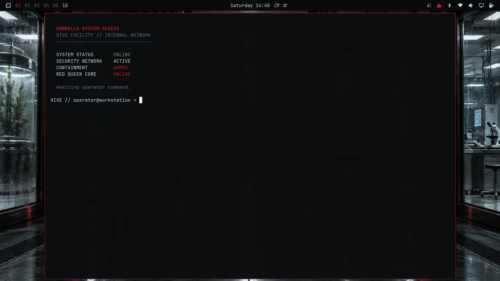
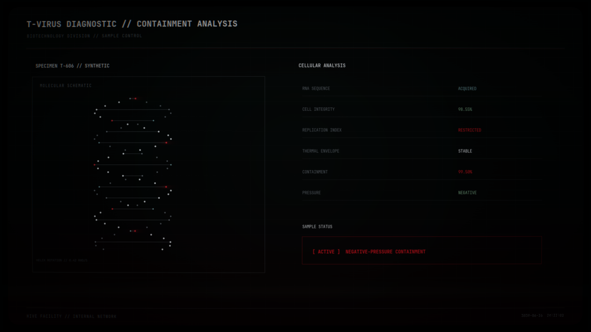
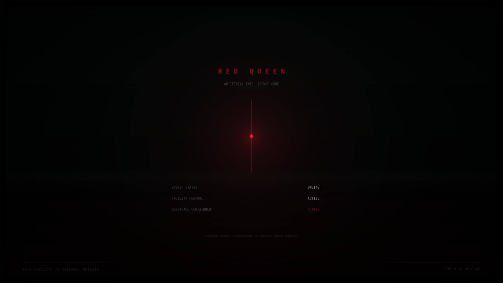

# The Hive

An unofficial Omarchy theme inspired by the clinical, industrial atmosphere of
the 2002 *Resident Evil* film: sterile laboratories, containment systems,
gunmetal surfaces, cold terminal light, and restrained emergency red.



This is an unofficial fan project. It is not affiliated with, authorized by,
or endorsed by Capcom or any other *Resident Evil* rights holder. *Resident
Evil*, Umbrella Corporation, and related names and marks belong to their
respective owners.

## Base theme

The base package follows the current Omarchy 4 community-theme format. The
standard theme installation does not execute any optional integration code and
provides:

- a complete dark `colors.toml` palette;
- Omarchy Shell colors for the bar, launcher, menus, notifications, OSD, and
  lock screen;
- eight coordinated 16:9 wallpapers;
- matching unlock artwork;
- a compact btop palette;
- the shipped Yaru red icon variant.

Install and apply it with Omarchy's standard installer:

```bash
omarchy theme install https://github.com/GazzasaurusRex/omarchy-hive-theme.git
```

Cycle through the included wallpapers with:

```bash
omarchy theme bg next
```

## Optional Hive extras

The extras are deliberately not installed by `omarchy theme install`. Review
[`extras/README.md`](extras/README.md) before enabling them.

The URL installation command above leaves the repository checkout under
`~/.config/omarchy/themes/hive/`, so the extras installer is available there.
The themes.omarchy.org marketplace uses a sparse base-theme checkout and does
not download executable extras; marketplace users who want them must clone or
download this repository separately and run the reviewed installer from that
checkout.

They add:

- a persistent GTK 4/OpenGL Hive screensaver with five scenes;
- GPU-rendered CRT scanlines, sweep, noise, glow, vignette, interference, and
  scene animation;
- a Hive-aware replacement for Omarchy's idle service;
- compact two-digit “sector” workspace indicators;
- an optional Hive Starship prompt;
- optional, disabled-by-default synthetic event sounds.

The installer copies the screensaver to
`~/.local/share/omarchy-hive-theme/`, installs two user-owned Omarchy Shell
plugins, edits only their relevant entries in
`~/.config/omarchy/shell.json`, and records backups under
`~/.local/state/omarchy-hive-theme/`. It does not use `sudo`.

```bash
~/.config/omarchy/themes/hive/extras/install.sh
```

Existing idle timings are preserved by default. To reproduce the original
150-second screensaver and 300-second lock timing:

```bash
~/.config/omarchy/themes/hive/extras/install.sh \
  --screensaver-seconds 150 \
  --lock-seconds 300
```

Add `--with-starship` if you also want the prompt. Run `--help` for all options.

### Screensaver scenes

- Hive Security Terminal
- Biological Containment Lockdown
- T-virus Diagnostic
- Red Queen AI Core
- Hive CCTV Surveillance

Static scene content is rendered only when state changes. A small GLSL pass
animates the display at approximately 24 FPS. GTK selects the system's normal
OpenGL device automatically; the code contains no Intel, AMD, or NVIDIA
vendor lock. Each monitor receives its own fullscreen surface. The 16:9 scene
layout is aspect-fitted and letterboxed where necessary instead of assuming a
specific resolution.

Preview it manually:

```bash
~/.local/share/omarchy-hive-theme/screensaver/hive-screensaver preview
```

Move the pointer, click, scroll, or press a key to dismiss it.

## Screenshots

### Desktop and terminal


### T-virus diagnostic



### Red Queen core



A privacy checklist for capturing the launcher/menu, lock screen, and an
additional facility-terminal scene is in
[`docs/screenshots/CAPTURE.md`](docs/screenshots/CAPTURE.md). Those views are
deliberately not represented by fabricated mock-ups.

## Requirements

The base theme requires Omarchy 4.0 or newer.

The optional screensaver expects packages normally present on Omarchy:

- Python 3
- GTK 4
- PyGObject (`python-gobject`)
- pycairo (`python-cairo`)
- OpenGL through `libglvnd`
- `jq` for safe Shell configuration edits
- a working Wayland/OpenGL driver with OpenGL 3.3 or newer

JetBrains Mono Nerd Font is recommended. Cairo will fall back to another
monospace face if it is unavailable.

The extras installer checks dependencies before changing files. There is no
CPU-heavy Cairo animation fallback: if OpenGL cannot be initialized, the
screensaver exits with a clear diagnostic instead.

## Uninstall

Remove the optional integrations first:

```bash
~/.config/omarchy/themes/hive/extras/uninstall.sh
```

The uninstaller removes only Hive-owned plugin/data directories and reverses
the Shell entries recorded during installation. It leaves later user changes
to idle timings or Starship untouched when they no longer match the installed
values.

Then switch to another theme and remove the base theme:

```bash
omarchy theme set catppuccin
omarchy theme remove hive
```

## Troubleshooting

**The base theme works but there is no Hive screensaver**

That is expected until the optional extras installer is run.

**The screensaver reports a missing dependency**

Confirm `python`, `gtk4`, `python-gobject`, `python-cairo`, and `libglvnd` are
installed. The installer intentionally does not install packages or invoke
`sudo` on the user's behalf.

**The screen is black or OpenGL context creation fails**

Update the active Mesa/NVIDIA driver and verify ordinary GTK 4 OpenGL apps can
run in the Wayland session. The renderer uses GTK's selected GPU and does not
set `DRI_PRIME` or vendor-specific environment variables.

**The stock idle service remains active**

Run the installer again; it is idempotent. Then use:

```bash
omarchy-shell shell rescanPlugins
```

**Restore the exact pre-install Shell configuration**

Timestamped and first-install backups are retained in
`~/.local/state/omarchy-hive-theme/` for manual recovery.

## Known limitations

- The optional Shell plugins track Omarchy 4's plugin API and may require an
  update after a future major Omarchy release.
- Non-16:9 screens use dark letterboxing to preserve the scene geometry.
- Event sounds are included as optional assets but are not bound to desktop
  actions.
- Remote Omarchy themes cannot ship executable top-level Lua, so the public
  base package does not install custom Hyprland animation overrides.

## Credits and licensing

The palette, renderer, GLSL effects, layouts, synthetic sounds, SVG artwork,
and generated wallpaper compositions were created for this project. No film
stills, movie footage, soundtrack music, actor likenesses, or ripped game/movie
assets are included. See [`docs/ARTWORK.md`](docs/ARTWORK.md) for provenance.

Original code and configuration are MIT licensed; see [`LICENSE`](LICENSE).
Original visual and audio assets are offered under CC BY 4.0 to the extent the
project author can license them; see [`LICENSE-ASSETS.md`](LICENSE-ASSETS.md).
Third-party names and marks are excluded from those grants. Modified Omarchy
Shell plugin portions retain the upstream MIT terms and attribution in
[`NOTICE`](NOTICE).
